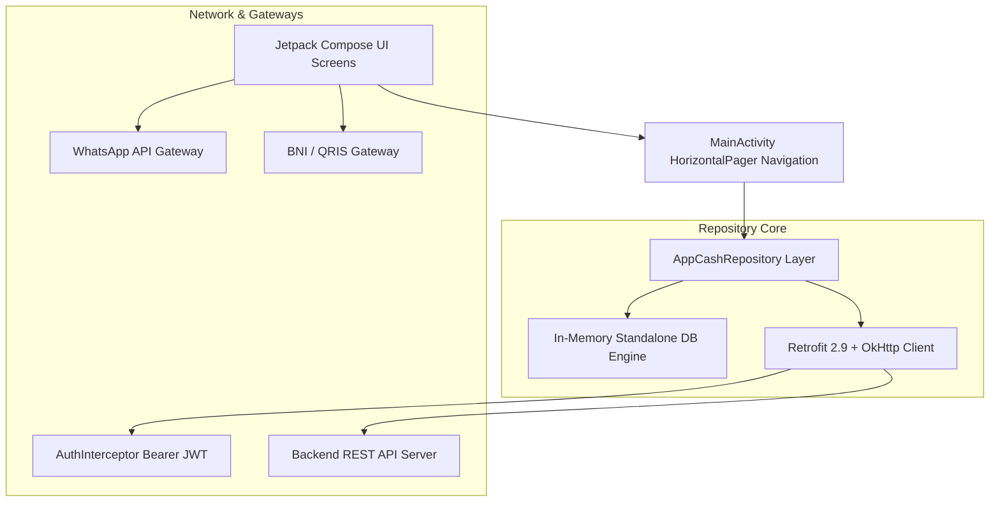

# 💸 AppCash — Sistem Manajemen Kas & Keuangan Kelas XII PPLG

<div align="center">


[](https://developer.android.com)
[](https://developer.android.com)
[](https://kotlinlang.org)
[](https://developer.android.com/jetpack/compose)
[](#-optimasi-build--apk-footprint)

**Aplikasi Android Native Modern & Offline-First untuk Pengelolaan Kas, Keuangan, serta Transaksi Digital Kelas XII PPLG (Rekayasa Perangkat Lunak).**

[Fitur Utama](#-fitur-utama-aplikasi) • [Arsitektur Sistem](#-arsitektur-sistem--pola-desain) • [Kekompleksan Kode & Highlight](#-kekompleksan-kode--highlight-teknis) • [Panduan Build](#-panduan-instalasi--build)

</div>

---

## 📌 Ringkasan Aplikasi & Materi Utama

**AppCash** dirancang khusus untuk memenuhi kebutuhan transparansi dan efisiensi manajemen keuangan kelas **XII PPLG**. Aplikasi ini memadukan **desain visual premium "Warm Sunset Orange & Modern Card Design"** dengan arsitektur **Offline-First & Dynamic REST API backend fallback**, memastikan aplikasi dapat digunakan tanpa hambatan jaringan di lingkungan sekolah.

### 🎯 Tujuan Utama Aplikasi
1. **Transparansi Keuangan**: Menyajikan data kas masuk, kas keluar, dan saldo riil secara real-time.
2. **Kemudahan Pembayaran**: Menyediakan metode transfer langsung via **Bank BNI** dan **Scan QRIS** yang terhubung secara otomatis ke admin WhatsApp.
3. **Pencatatan Otomatis & Terstruktur**: Mengeliminasi pembukuan manual dengan rekapitulasi pembayaran mingguan per siswa (M01 hingga M20).
4. **Sistem Denda Otomatis**: Menerapkan denda 5% per bulan untuk setiap tunggakan kas mingguan guna menjaga kedisiplinan iuran kelas.
5. **Autentikasi Berbasis Peran & Profil**: Sesi login terpisah untuk **Admin** (akses edit/full) dan **Siswa** (akses read-only) dilengkapi dengan halaman Profil pengguna dan fungsi Logout.
6. **Performa Tinggi & Ringan**: Ukuran APK teroptimasi (**~8.7 MB**) dengan kompatibilitas dari Android 8.0 (Oreo) hingga Android 16 (One UI 8).

---

## 🛠️ Arsitektur Sistem & Pola Desain

Aplikasi ini dibangun menggunakan arsitektur **Single Activity Compose Navigation** berkonsep **Clean Architecture** sederhana:



---

## 🔥 Kekompleksan Kode & Highlight Teknis

Aplikasi **AppCash** menyimpan sejumlah teknik pemrograman tingkat lanjut yang menjadikan kodenya efisien, aman, dan responsif. Berikut adalah rekapitulasi kekompleksan kode penting pada setiap komponen utama:

---

### 1. Custom Graphic Canvas Rendering (`WeeklyKasBarChart`)
> 📂 **File**: [`DashboardScreen.kt`](appcash-android/app/src/main/java/com/appcash/ui/screens/DashboardScreen.kt)

Untuk menyajikan grafik tren keuangan tanpa bergantung pada library pihak ketiga yang memperbesar ukuran APK, aplikasi memanfaatkan **Jetpack Compose Native Canvas Drawing Scope**.

```kotlin
@Composable
fun WeeklyKasBarChart(
    labels: List<String>,
    incomes: List<Int>,
    expenses: List<Int>,
    modifier: Modifier = Modifier
) {
    // Menghitung batas maksimum skalar secara dinamis
    val maxVal = (incomes.maxOrNull() ?: 1).coerceAtLeast(expenses.maxOrNull() ?: 1).toFloat()

    Canvas(modifier = modifier) {
        if (size.width <= 0f || size.height <= 24.dp.toPx()) return@Canvas
        val barWidth = 14.dp.toPx()
        val spacing = size.width / (labels.size.coerceAtLeast(1))
        val chartHeight = size.height - 24.dp.toPx()

        labels.forEachIndexed { i, _ ->
            val xCenter = spacing * i + (spacing / 2)
            val incomeVal = incomes.getOrElse(i) { 0 }
            val expenseVal = expenses.getOrElse(i) { 0 }

            // Kalkulasi rasio tinggi bar terhadap canvas height
            val incomeBarHeight = ((incomeVal / maxVal) * chartHeight).coerceAtLeast(4f)
            val expenseBarHeight = ((expenseVal / maxVal) * chartHeight).coerceAtLeast(if (expenseVal > 0) 4f else 0f)

            // Canvas drawing rounded bars
            drawRoundRect(
                color = Color(0xFF22C55E), // Hijau Pemasukan
                topLeft = Offset(xCenter - barWidth - 2.dp.toPx(), chartHeight - incomeBarHeight),
                size = Size(barWidth, incomeBarHeight),
                cornerRadius = CornerRadius(4.dp.toPx())
            )

            if (expenseVal > 0) {
                drawRoundRect(
                    color = Color(0xFFEF4444), // Merah Pengeluaran
                    topLeft = Offset(xCenter + 2.dp.toPx(), chartHeight - expenseBarHeight),
                    size = Size(barWidth, expenseBarHeight),
                    cornerRadius = CornerRadius(4.dp.toPx())
                )
            }
        }
    }
}
```
* **Point Kompleksitas**: Kalkulasi koordinat piksel dinamis (`xCenter`, `chartHeight`), normalisasi batas skala nilai (`maxVal`), dan eksekusi instruksi gambar langsung ke GPU tanpa overhead View Hierarchy.

---

### 2. Standardized Dual Engine Repository & Thread-Safe Coroutine Sync
> 📂 **File**: [`AppCashRepository.kt`](appcash-android/app/src/main/java/com/appcash/data/repository/AppCashRepository.kt)

Repository mengimplementasikan pola **In-Memory Standalone Data Engine** yang aman dari operasi I/O blocking dengan membungkus hasil respons dalam pembungkus fungsional Kotlin `Result<T>`.

```kotlin
suspend fun getDashboard(): Result<Dashboard> = withContext(Dispatchers.IO) {
    var totalPaymentsCount = 0
    var totalKasIncome = 0
    val weeklyIncomeList = mutableListOf<Int>()
    val weeklyExpensesList = mutableListOf<Int>()
    val weeklyLabelsList = mutableListOf<String>()

    // Algoritma Agregasi Data Pembayaran Per-Minggu
    datesList.forEachIndexed { index, date ->
        var weekPaid = 0
        paymentRecords.values.forEach { m -> 
            if (m[date] == true) { 
                weekPaid++
                totalPaymentsCount++ 
            } 
        }
        val weekIncome = weekPaid * configData.kasAmount
        totalKasIncome += weekIncome

        if (index % 2 == 1) {
            weeklyLabelsList.add("M${index + 1}")
            weeklyIncomeList.add(weekIncome * 2)
            val exp = when (index) {
                1 -> 45000; 3 -> 195000; 7 -> 215000; 15 -> 380000; 19 -> 340000; else -> 0
            }
            weeklyExpensesList.add(exp)
        }
    }

    val totalExpenseAmount = expensesList.sumOf { it.amount }
    val netBalance = configData.previousBalance + totalKasIncome - totalExpenseAmount

    Result.success(
        Dashboard(
            totalBalance = netBalance,
            previousBalance = configData.previousBalance,
            kasAmount = configData.kasAmount,
            totalKasIncome = totalKasIncome,
            totalPayments = totalPaymentsCount,
            totalPaymentDates = datesList.size,
            totalMembers = membersList.size,
            totalExpenseAmount = totalExpenseAmount,
            totalExpenseCount = expensesList.size,
            latestPaid = paymentRecords.values.count { it[datesList.last()] == true },
            weeklyLabels = weeklyLabelsList,
            weeklyKasIncome = weeklyIncomeList,
            weeklyExpenses = weeklyExpensesList
        )
    )
}
```
* **Point Kompleksitas**: Agregasi matriks pembayaran `Map<String, Map<String, Boolean>>`, kalkulasi saldo bersih dinamis, serta perpindahan konteks eksekusi thread menggunakan `withContext(Dispatchers.IO)`.

---

### 3. Dynamic HTTP Interceptor & Retrofit Service Integration
> 📂 **File**: [`ApiService.kt`](appcash-android/app/src/main/java/com/appcash/network/ApiService.kt)

Menggunakan pattern **Singleton Interceptor** untuk menyuntikkan token otentikasi Bearer JWT ke seluruh outgoing HTTP Request OkHttp secara otomatis.

```kotlin
class AuthInterceptor private constructor() : okhttp3.Interceptor {
    private var token: String? = null

    fun setToken(newToken: String?) { token = newToken }
    fun clearToken() { token = null }

    override fun intercept(chain: okhttp3.Interceptor.Chain): okhttp3.Response {
        val original = chain.request()
        val request = original.newBuilder()
        val tokenToUse = token
        if (!tokenToUse.isNullOrBlank()) {
            request.header("Authorization", "Bearer $tokenToUse")
        }
        return chain.proceed(request.build())
    }

    companion object {
        private var instance: AuthInterceptor? = null
        fun getInstance(): AuthInterceptor {
            if (instance == null) { instance = AuthInterceptor() }
            return instance!!
        }
    }
}
```
* **Point Kompleksitas**: Implementasi thread-safe Singleton, manipulasi HTTP request headers pada lapisan jaringan OkHttp, serta enkapsulasi token akses.

---

### 4. Gestural Navigation & Elevated Floating Home Navigation Bar
> 📂 **File**: [`MainActivity.kt`](appcash-android/app/src/main/java/com/appcash/ui/MainActivity.kt)

Sistem navigasi tidak mengggunakan fragment lawas, melainkan **Compose HorizontalPager** yang disinkronisasikan secara interaktif dengan Bottom Navigation Bar.

```kotlin
val pagerState = rememberPagerState(initialPage = 2) { bottomNavItems.size }

Scaffold(
    bottomBar = {
        Surface(shadowElevation = 8.dp, color = Color.White) {
            Row(
                modifier = Modifier.fillMaxWidth().height(72.dp),
                horizontalArrangement = Arrangement.SpaceEvenly
            ) {
                bottomNavItems.forEachIndexed { index, screen ->
                    val selected = pagerState.currentPage == index
                    val isCenter = index == 2 // Center Home Floating Button

                    if (isCenter) {
                        // Tombol Utama Melayang (Elevated Center Button)
                        Box(
                            modifier = Modifier
                                .offset(y = (-8).dp)
                                .size(52.dp)
                                .clip(CircleShape)
                                .background(if (selected) OrangePrimary else OrangeContainer),
                            contentAlignment = Alignment.Center
                        ) {
                            IconButton(onClick = { scope.launch { pagerState.animateScrollToPage(index) } }) {
                                Icon(
                                    imageVector = if (selected) screen.iconFilled else screen.icon,
                                    contentDescription = screen.label,
                                    tint = if (selected) Color.White else OrangePrimary
                                )
                            }
                        }
                    } else {
                        // Regular Nav Item
                        // ...
                    }
                }
            }
        }
    }
) { innerPadding ->
    HorizontalPager(state = pagerState, modifier = Modifier.padding(innerPadding)) { page ->
        when (page) {
            0 -> PaymentsScreen(repository = repository, isAdmin = isAdmin)
            1 -> ExpensesScreen(repository = repository, isAdmin = isAdmin)
            2 -> DashboardScreen(repository = repository, isAdmin = isAdmin)
            3 -> ScheduleScreen()
            4 -> MembersScreen(repository = repository)
        }
    }
}
```
* **Point Kompleksitas**: Sinkronisasi 2-arah antara gestur usap layar (`HorizontalPager`) dan status tab navigasi bawah, offset elevasi tombol tengah, serta animasi skroll halus via coroutine scope.

---

### 5. Multi-Channel Transfer Engine (BNI Bank + QRIS & WA Admin Auto-Confirmation)
> 📂 **File**: [`PaymentsScreen.kt`](appcash-android/app/src/main/java/com/appcash/ui/screens/PaymentsScreen.kt)

Memungkinkan siswa memilih item pembayaran kas mingguan yang belum lunas, menghitung total biaya secara otomatis, menyalin nomor rekening BNI, serta membuat tautan konfirmasi WhatsApp langsung.

```kotlin
val totalAmount = selectedCount * 5000 // Rp 5.000 / minggu

Button(
    onClick = {
        val memberName = selectedMember?.name ?: "Siswa"
        val message = "Halo Admin Kas XII PPLG, saya $memberName telah transfer iuran kas via BNI 1892077413 sebesar Rp ${formatRupiah(totalAmount)} ($selectedCount minggu). Mohon konfirmasi."
        val intent = Intent(Intent.ACTION_VIEW, Uri.parse("https://api.whatsapp.com/send?phone=6285600487433&text=${Uri.encode(message)}"))
        try { context.startActivity(intent) } catch (e: Exception) {
            Toast.makeText(context, "Membuka WhatsApp Admin...", Toast.LENGTH_SHORT).show()
        }
        isWaConfirmed = true
    },
    enabled = selectedCount > 0,
    colors = ButtonDefaults.buttonColors(containerColor = Color(0xFF25D366))
) {
    Icon(Icons.Default.Send, contentDescription = null)
    Text("1. Kirim Bukti ke WA Admin", fontWeight = FontWeight.Bold)
}
```

---

### 6. Algoritma Kalkulasi Denda 5% Per Bulan (`getDendaForMember`)
> 📂 **File**: [`AppCashRepository.kt`](appcash-android/app/src/main/java/com/appcash/data/repository/AppCashRepository.kt)

Perhitungan denda dilakukan secara otomatis berdasarkan akumulasi tunggakan kas mingguan per anggota:

```kotlin
fun getDendaForMember(memberId: Int): DendaInfo {
    val memberKey = memberId.toString()
    val memberRecords = paymentRecords[memberKey] ?: emptyMap()
    val unpaidCount = datesList.count { date -> memberRecords[date] != true }
    val unpaidKasAmount = unpaidCount * configData.kasAmount

    // Denda 5% per bulan untuk tunggakan kas
    val monthsUnpaid = (unpaidCount + 3) / 4 // Asumsi 4 minggu = 1 bulan
    val dendaPercentage = 0.05
    val dendaAmount = if (unpaidCount > 0) (unpaidKasAmount * dendaPercentage * monthsUnpaid).toInt() else 0

    return DendaInfo(
        memberId = memberId,
        unpaidWeeks = unpaidCount,
        unpaidKasAmount = unpaidKasAmount,
        dendaAmount = dendaAmount,
        totalDebt = unpaidKasAmount + dendaAmount
    )
}
```
* **Point Kompleksitas**: Kalkulasi proporsional tunggakan mingguan terhadap pembulatan bulan (`monthsUnpaid`), perhitungan denda 5%, serta komposisi total hutang kas.

---

### 7. Session Auth State & Role-Based Content Guard (`AppRoot`)
> 📂 **File**: [`MainActivity.kt`](appcash-android/app/src/main/java/com/appcash/ui/MainActivity.kt)

Sistem autentikasi mengelola perpindahan layar secara reaktif antara `LoginScreen` dan `MainContent` serta membatasi hak akses role-based:

```kotlin
@Composable
fun AppRoot(repository: AppCashRepository) {
    var isLoggedIn by remember { mutableStateOf(repository.isLoggedIn) }
    var currentRole by remember { mutableStateOf(repository.currentRole) }
    val isAdmin = currentRole == "admin"

    if (!isLoggedIn) {
        LoginScreen(
            repository = repository,
            onLoginSuccess = { role ->
                currentRole = role
                isLoggedIn = true
            }
        )
    } else {
        MainContent(
            repository = repository,
            isAdmin = isAdmin,
            onLogout = {
                repository.logout()
                isLoggedIn = false
            }
        )
    }
}
```
* **Point Kompleksitas**: Dynamic State-driven screen switching tanpa fragment rebuild, penanganan callback logout clean-up session, dan propagasi parameter `isAdmin` ke seluruh composable screens.


---

## ⚡ Fitur Utama Aplikasi

| Modul | Deskripsi & Kemampuan |
| :--- | :--- |
| **🔐 Autentikasi Sesi** | **Admin**: Login via Email (`admin@gmail.com`) & Password (`admin123`) untuk akses full.<br>**Siswa**: Login via Dropdown Anggota (read-only mode). |
| **⚠️ Denda Kas 5%/Bulan** | Otomatis menghitung denda keterlambatan **5% per bulan** dari total nominal kas yang nunggak. Ringkasan denda muncul di Dashboard & Profil. |
| **👤 Profil & Logout** | Halaman Profil pengguna (Nama, Jabatan, NIS/Email, Telepon, Bio), fitur **Edit Profil**, kartu peringatan denda, dan tombol **Log Out**. |
| **📊 Dashboard Keuangan** | Menampilkan Total Kas Kelas, Pemasukan, Pengeluaran, Jumlah Anggota (33 Siswa), Grafik Tren Mingguan, dan Ringkasan Denda Kas. |
| **💳 Pembayaran Kas** | Rekapitulasi pembayaran M01–M20, Modal Transfer Bank BNI (1892077413), QRIS NMID ID1026507245623, dan opsi edit status kas bagi Admin. |
| **💸 Pengeluaran Kas** | Pencatatan transaksi pengeluaran kas (Deskripsi, Jumlah Rp, Tanggal, Kategori), filter list dinamis, dan hapus pengeluaran (Admin). |
| **👥 Anggota XII PPLG** | Directory 33 siswa lengkap dengan NIS, Jabatan (Ketua Kelas, Wakil, Bendahara, Sekretaris, Anggota), Avatar Inisial Offline-Safe, Pencarian Nama/NIS, dan Modal Bio Siswa. |

---

## 🔒 Hak Akses Berdasarkan Peran (Role-Based Access Control)

| Fitur / Halaman | Admin (`admin@gmail.com`) | User / Siswa |
| :--- | :---: | :---: |
| **Login Sesi & Logout** | ✅ | ✅ |
| **Lihat Dashboard & Denda** | ✅ | ✅ |
| **Lihat Pembayaran Kas** | ✅ | ✅ (Read-Only) |
| **Edit Status Pembayaran Kas** | ✅ | ❌ |
| **Lihat & Catat Pengeluaran** | ✅ | ✅ (Read-Only) |
| **Tambah / Hapus Pengeluaran** | ✅ | ❌ |
| **Lihat Profil & Edit Bio** | ✅ | ✅ |

---

## 🎨 Token Desain & Skema Warna

Aplikasi ini menggunakan skema warna **Warm Sunset & Cyber Orange**:

```
Primary Orange   : #FFFF6B00  ██████████
Light Orange     : #FFFF8C42  ██████████
Dark Orange      : #FFE55A00  ██████████
Orange Container : #FFF3E0    ██████████
Green Positive   : #22C55E    ██████████
Red Negative     : #EF4444    ██████████
```

---

## 🚀 Optimasi Build & APK Footprint

Konfigurasi peluncuran APK pada `build.gradle.kts` memanfaatkan kompresi ProGuard dan Minifikasi Resource untuk memangkas ukuran build akhir:

```kotlin
android {
    compileSdk = 35

    defaultConfig {
        applicationId = "com.appcash"
        minSdk = 26
        targetSdk = 35
        versionCode = 3
        versionName = "3.0.0"
    }

    buildTypes {
        release {
            isMinifyEnabled = true      // Mengaktifkan R8 / ProGuard Code Shrinking
            isShrinkResources = true    // Menghapus resource tidak terpakai
            proguardFiles(
                getDefaultProguardFile("proguard-android-optimize.txt"),
                "proguard-rules.pro"
            )
        }
    }
}
```

---

## 💻 Panduan Instalasi & Build

### Persyaratan Sistem
* **Android Studio**: Jellyfish / Koala / Ladybug (2024.1.1+)
* **JDK**: OpenJDK 11 atau lebih baru
* **Gradle**: 8.4+

### Langkah-langkah Build:

1. **Clone Repository**:
   ```bash
   git clone https://github.com/wira/appcash.git
   cd appcash/appcash-android
   ```

2. **Jalankan Gradle Build (Debug APK)**:
   ```bash
   ./gradlew assembleDebug
   ```

3. **Jalankan Build Ter-optimasi (Release APK)**:
   ```bash
   ./gradlew assembleRelease
   ```
   *Hasil APK akan berada di directory `app/build/outputs/apk/release/app-release.apk` (Ukuran ~8.7 MB).*

---

<div align="center">

**AppCash v3.0.0** • Dibuat dengan ❤️ untuk **XII PPLG**  
*Dikembangkan oleh Gede Agus Wira Darma Putra & Tim Developer XII PPLG*

</div>
